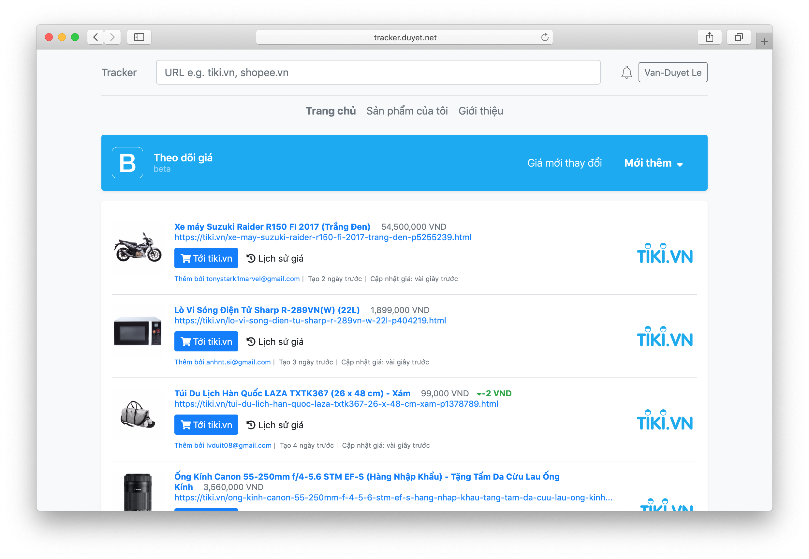
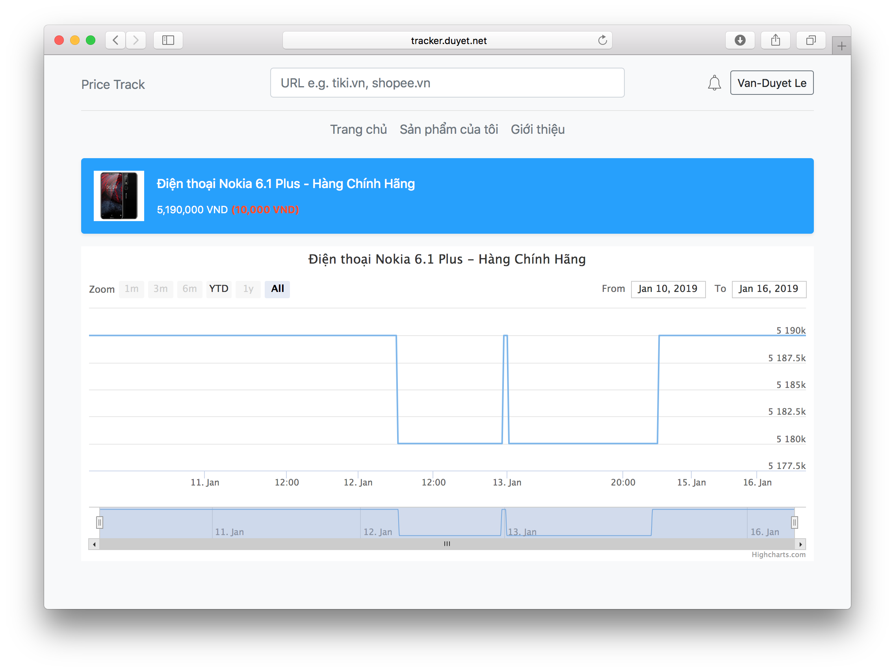
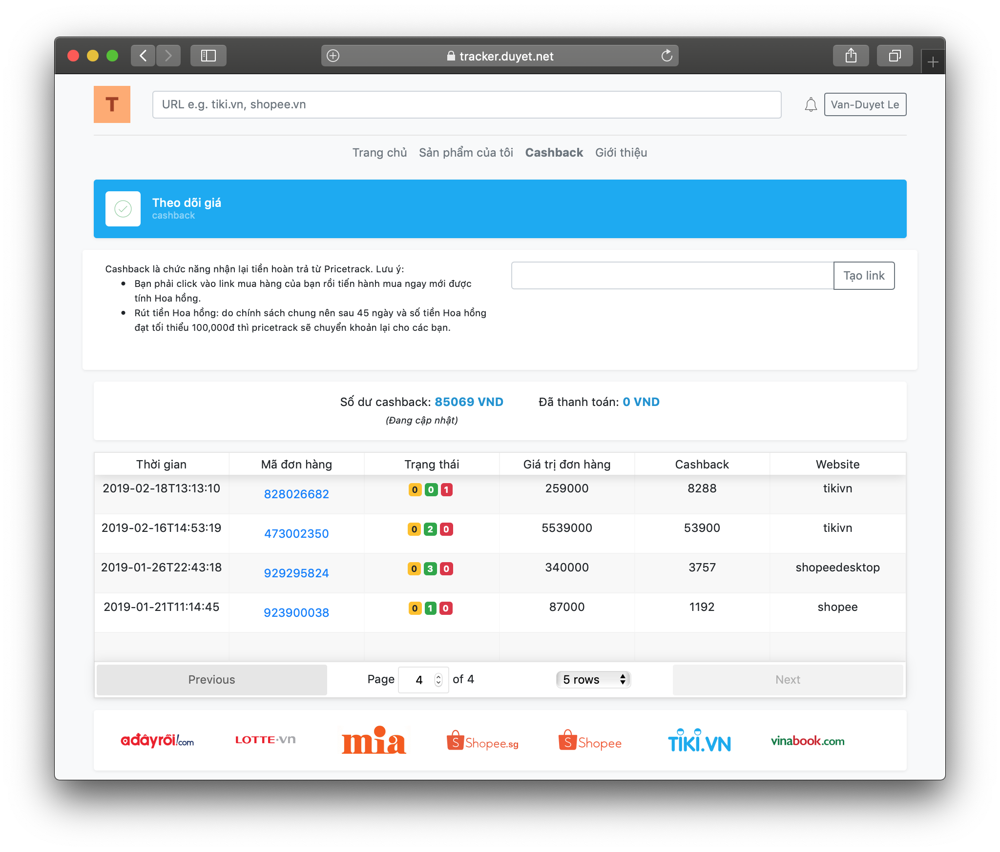
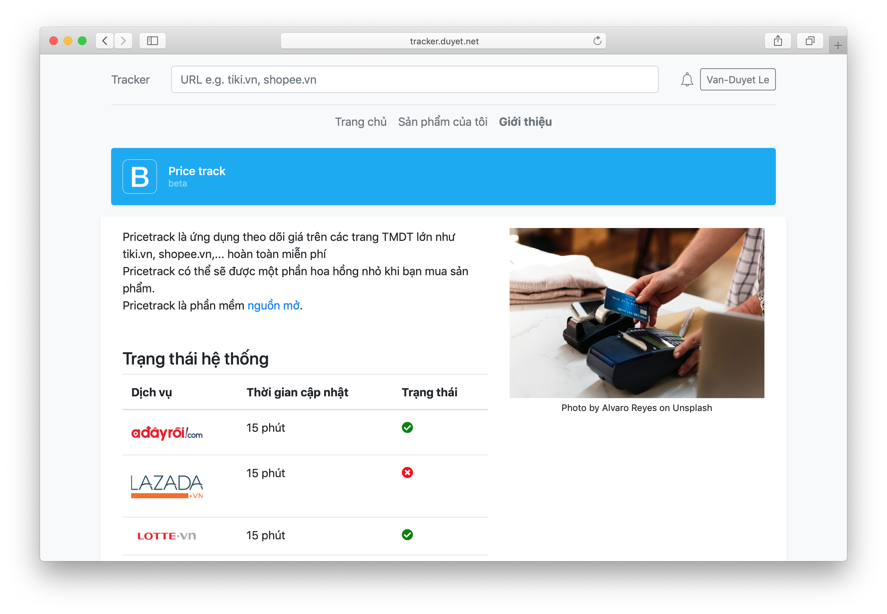
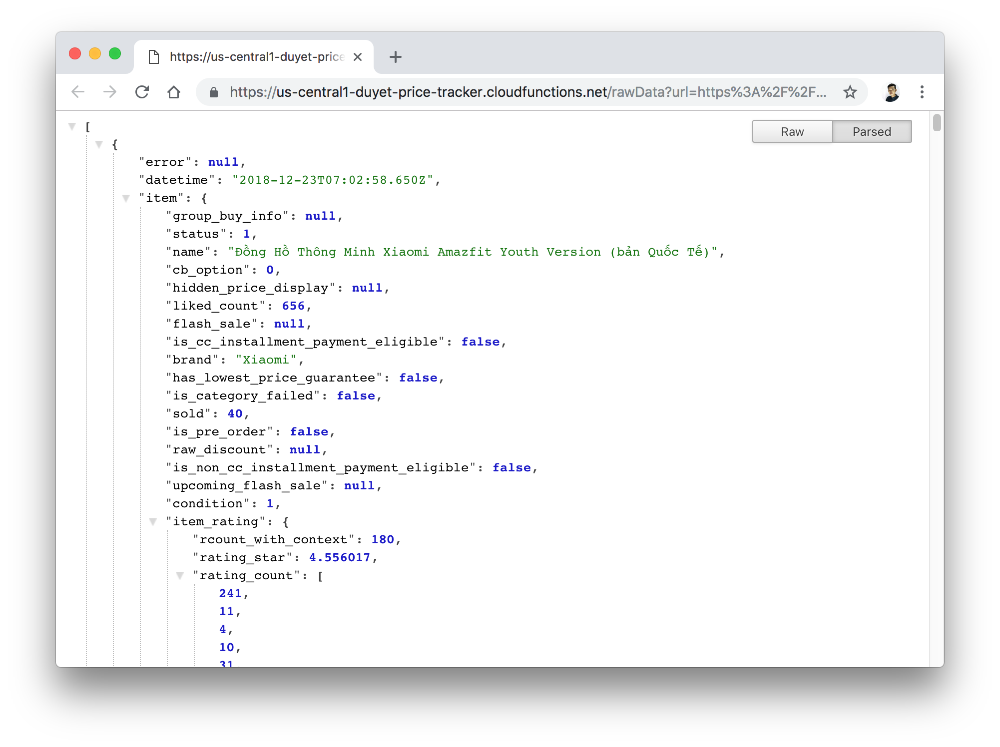
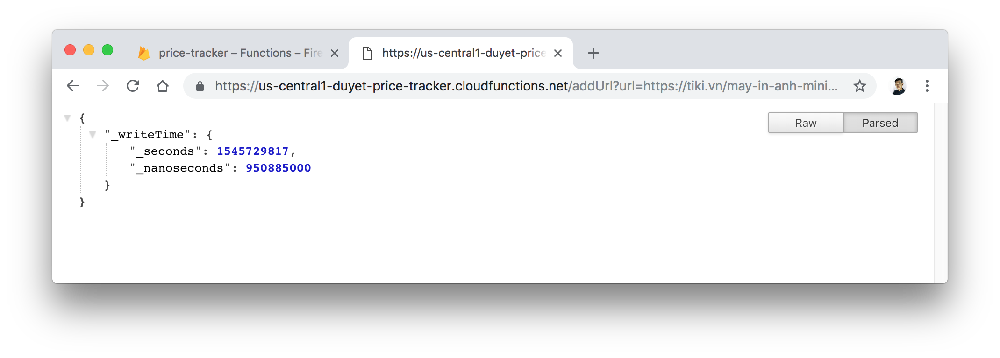
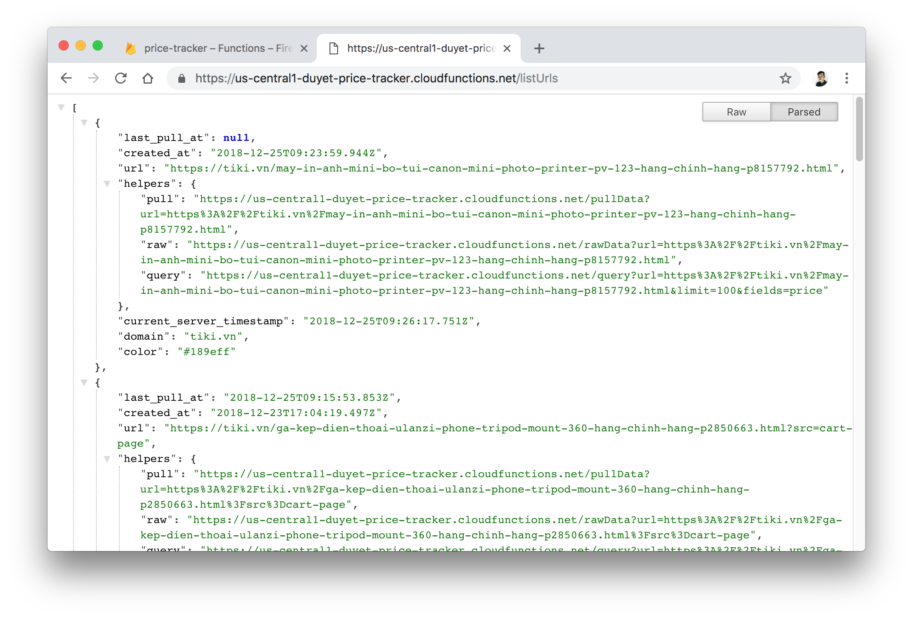
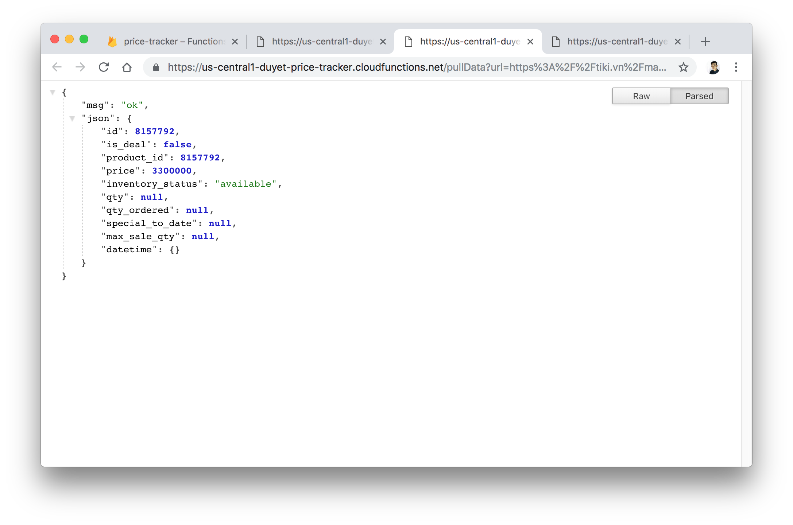
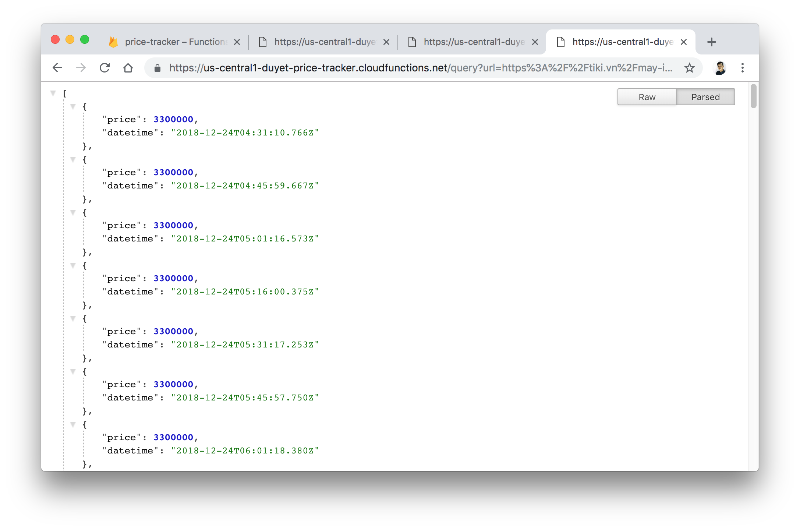
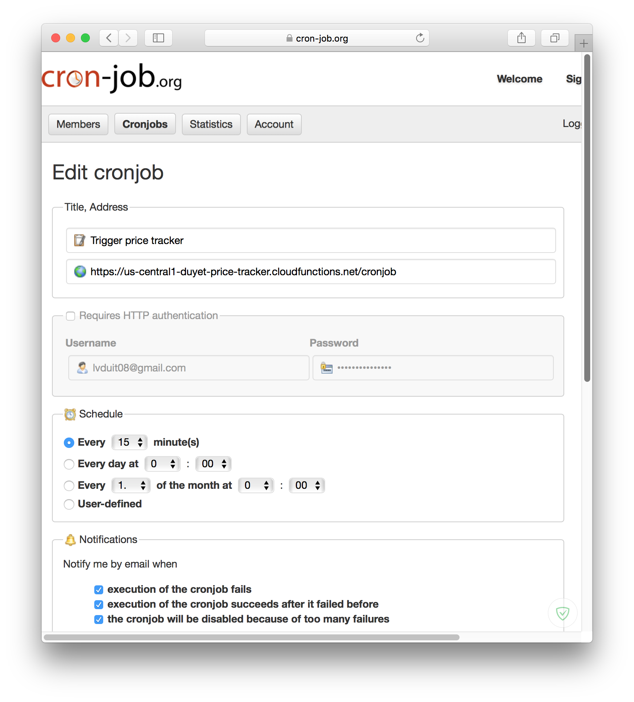

# Price Track Project (inprogress)

Auto collect, visualize and alert for product items.

**Live**: [https://pricetrack.web.app](https://pricetrack.web.app) or [https://tracker.duyet.net](https://tracker.duyet.net)

**Support**

<a href="https://s.duyet.net/r/patreon"></a>








# Installation

1. **Set up Node.js and the Firebase CLI**
	You'll need a Node.js environment. This project is written with Nodejs 8.x.
	After that, install the Firebase CLI via npm:

	```
	npm install -g firebase-tools
	```

	To initialize project: Run `firebase login` to log in via the browser and authenticate the firebase tool.

	Setup packages: `cd functions/ && npm install`

2. Go to https://console.firebase.google.com and create new project.

3. Setup env variables, copy and modify `env.example.sh` to `env.local.sh`
	```
	firebase functions:config:set pricetrack.sentry_dsn=https://abc@sentry.io/1362210
	firebase functions:config:set pricetrack.cronjob_key=696969
	firebase functions:config:set pricetrack.apiKey=xxxxxxooooooKMgWKRhUdY91
	firebase functions:config:set pricetrack.admin_token=xxxxxxxxxx
	firebase functions:config:set pricetrack.gmail_email=pricetrack.apps@gmail.com
	firebase functions:config:set pricetrack.gmail_password=xxxxxxxxxx
	firebase functions:config:set pricetrack.hosting_url=https://tracker.duyet.net
	firebase functions:config:set pricetrack.accesstrade_deeplink_base=https://fast.accesstrade.com.vn/deep_link/4557459014401077484
	firebase functions:config:set pricetrack.admin_email=lvduit08@gmail.com
	```

	Run: `bash ./env.local.sh`

3. Test in local: https://firebase.google.com/docs/functions/local-emulator
	- Export local configs: `firebase functions:config:get > functions/.runtimeconfig.json`
	- Start firebase: `firebase serve`
	- Start hosting local: `cd hosting && npm run develop`
	- Open UI: http://localhost:8000

4. **Deploy serverless functions and hosting to Firebase**
	```
	firebase deploy
	```

	You can also start this project locally via: `firebase serve`

	All functions will be list at Firebase Dashboard:

	

5. **Test your API**
	
	Add new URL: `https://<your-project>.cloudfunctions.net/addUrl?url=<your-url>`

	

	List: `https://<your-project>.cloudfunctions.net/listUrls`

	

	Pull data: `https://<your-project>.cloudfunctions.net/pullData?url=<your-url>`

	

	Query in raw data: `https://<your-project>.cloudfunctions.net/query?url=<your-url>&fields=datetime,price&limit=100`

	


6. **Setup the cronjob for /pullData**: https://cron-job.org

	


7. Check out the UI: https://tracker.duyet.net

	

# Technology

- UI Website for result (Gatsby.js, React.js)
- Cronjob trigger worker (https://www.google.com/search?num=20&q=cron+job+trigger, https://cron-job.org)
- Deployment:
	+ API: Firebase Functions
	+ Database: Firebase Firestore
	+ Web: Firebase Hosting, GatsbyJS

# Next Step

- Support for more domain
- Move worker pullData to Google Scripts to reduce cost.
- Auto trigger BUY, Add to cart
