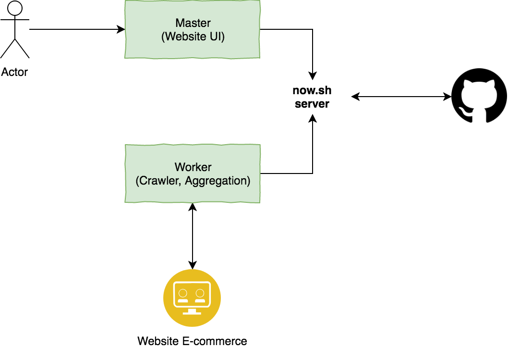

# pricetracker
Price Tracker

# Technology

- UI Website for result (Vue.js)
- Worker read config, parse content and push result to Github repo as a data storage (https://developer.github.com/v3/repos/contents/#create-a-file and https://developer.github.com/v3/repos/contents/#update-a-file).
- Cronjob trigger worker (https://www.google.com/search?num=20&q=cron+job+trigger)
- Deployment: now.sh

# Modules

- web
- api
- worker
