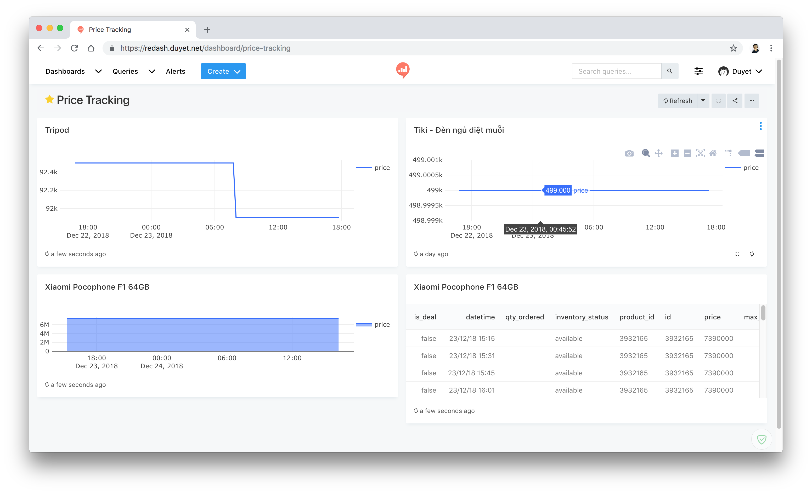
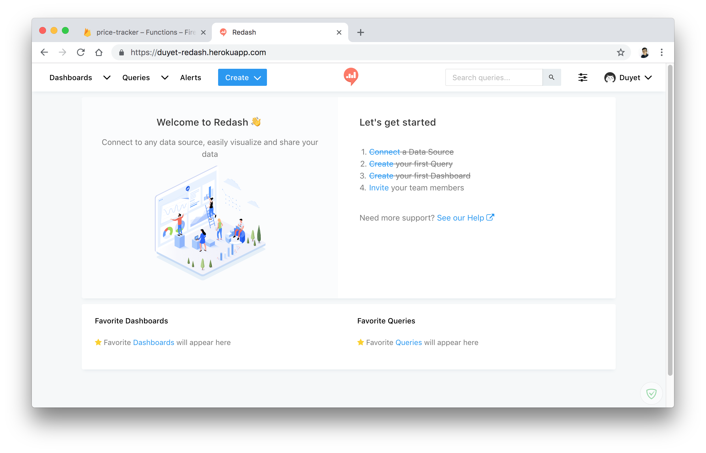
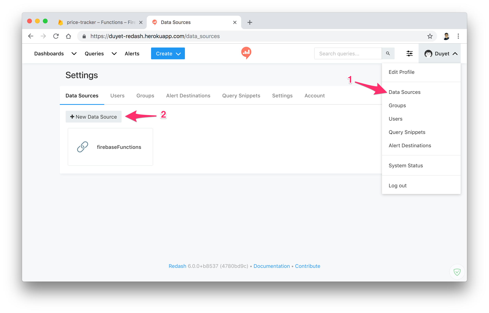
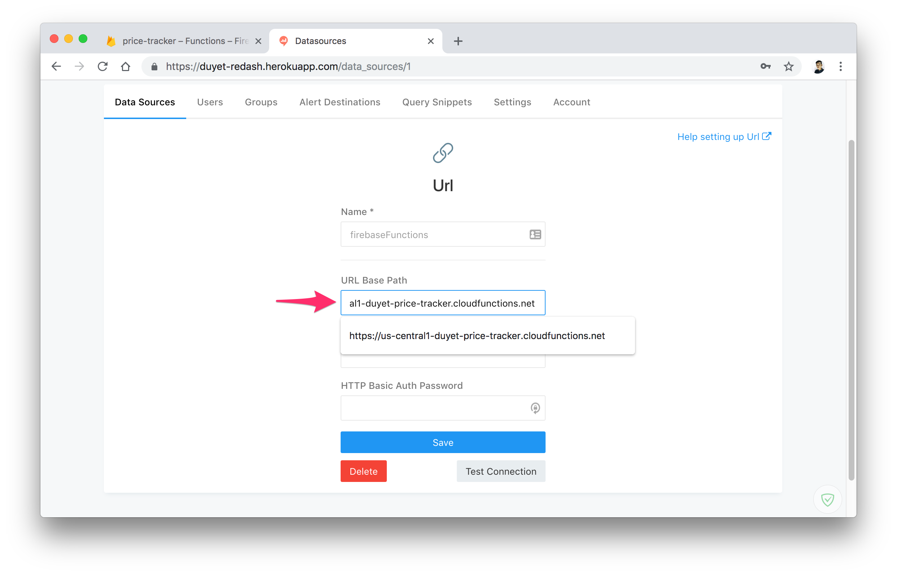
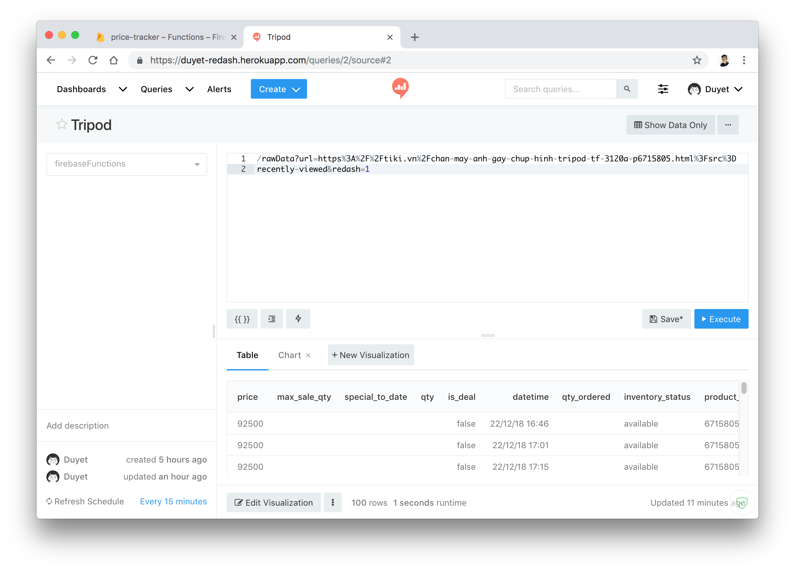
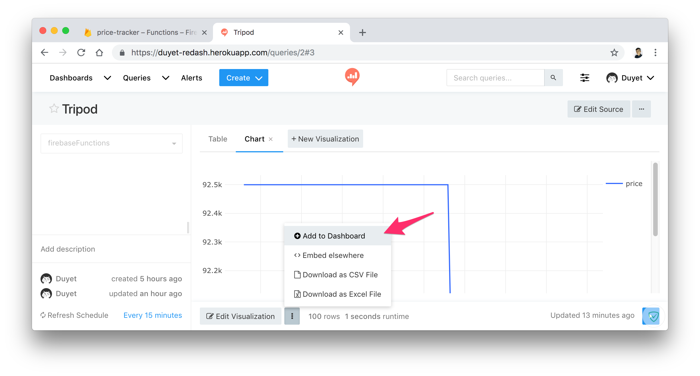
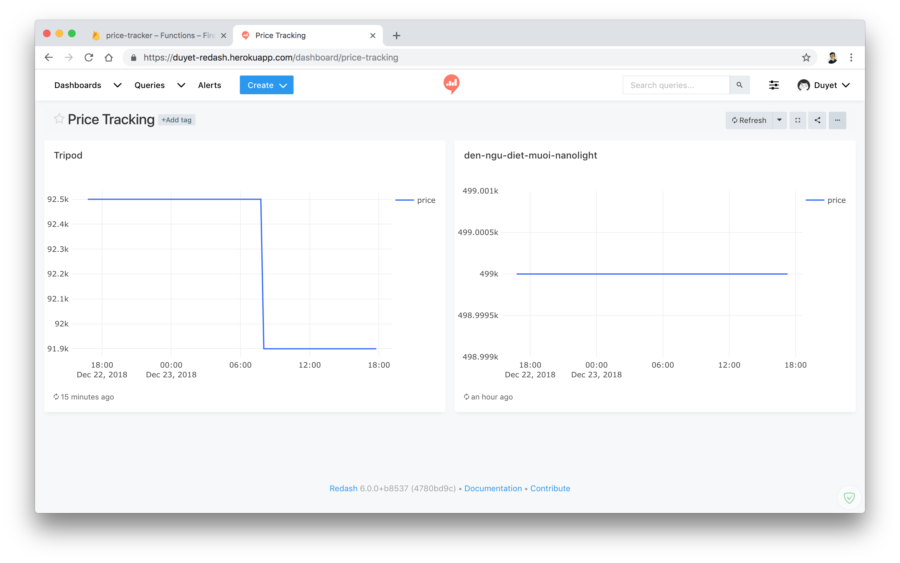
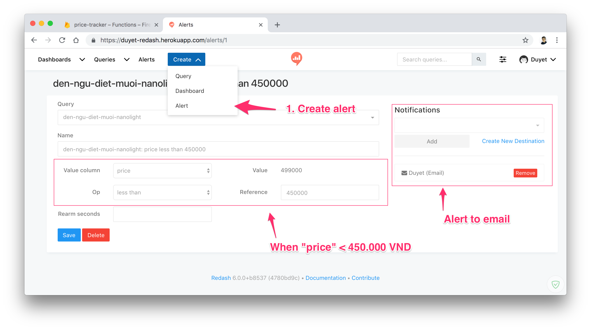

# Price Track Project (inprogress)

Auto collect, visualize and alert for product items.

**Live**: [https://tracker.duyet.net](https://tracker.duyet.net)





# Installation

1. **Set up Node.js and the Firebase CLI**
	You'll need a Node.js environment. This project is written with Nodejs 8.x.
	After that, install the Firebase CLI via npm:

	```
	npm install -g firebase-tools
	```

	To initialize project: Run `firebase login` to log in via the browser and authenticate the firebase tool.

	Setup packages: `cd functions/ && npm install`

2. Go to https://console.firebase.google.com and create new project.

3. **Deploy serverless functions and hosting to Firebase**
	```
	firebase deploy
	```

	You can also start this project locally via: `firebase serve`

	All functions will be list at Firebase Dashboard:

	

4. **Test your API**
	
	Add new URL: `https://<your-project>.cloudfunctions.net/addUrl?url=<your-url>`

	

	List: `https://<your-project>.cloudfunctions.net/listUrls`

	

	Pull data: `https://<your-project>.cloudfunctions.net/pullData?url=<your-url>`

	

	Query in raw data: `https://<your-project>.cloudfunctions.net/query?url=<your-url>&fields=datetime,price&limit=100`

	


5. **Setup the cronjob for /pullData**: https://cron-job.org

	

5. **Setup Redash on Heroku**: https://github.com/willnet/redash-on-heroku
	

	At API as Data Source:
	

	Enter your api URL:
	

	Query in Data Source:
	

	Visualize from Redash Query:
	

	Redash Dashboard:
	

	Final Dashboard:
	

	Alert when price change:
	


# Technology

- UI Website for result (Vue.js)
- Cronjob trigger worker (https://www.google.com/search?num=20&q=cron+job+trigger, https://cron-job.org)
- Deployment:
	+ API: Firebase Functions
	+ Database: Firebase Firestore
	+ Web: Firebase Hosting
- Visualization tools: Redash

# Next Step

- Support for more domain
- Move worker pullData to Google Scripts to reduce cost.
- Web UI
- Secure API
- Add Alert, Price Tracing
- Auto trigger BUY, Add to cart